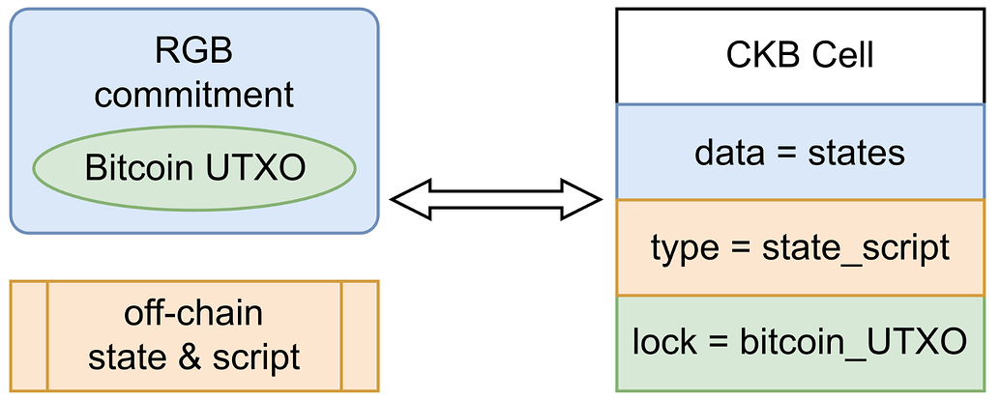
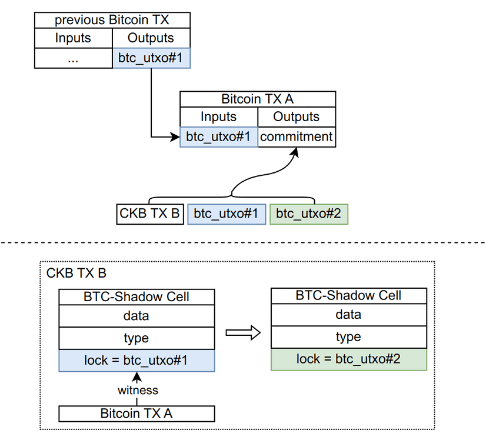
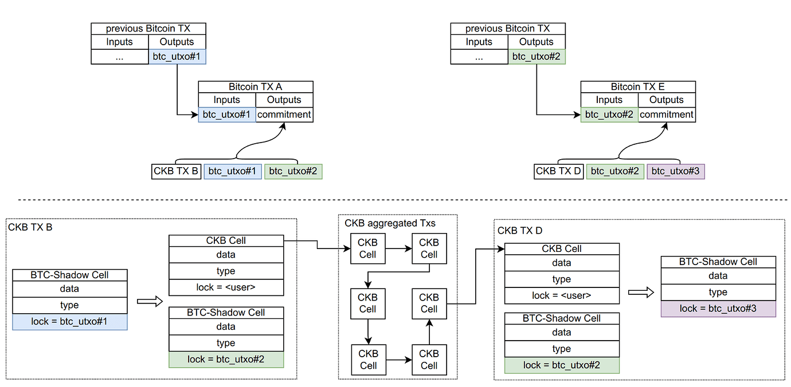
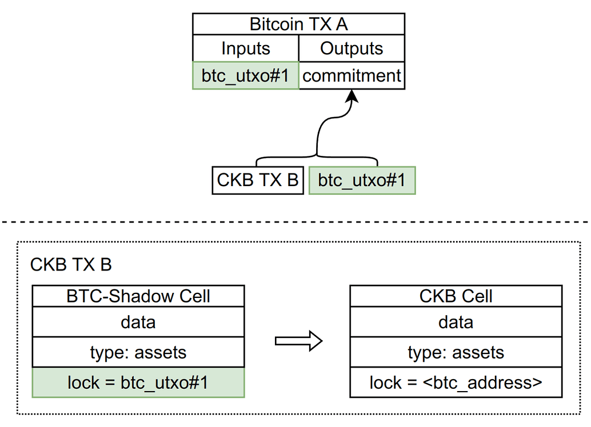
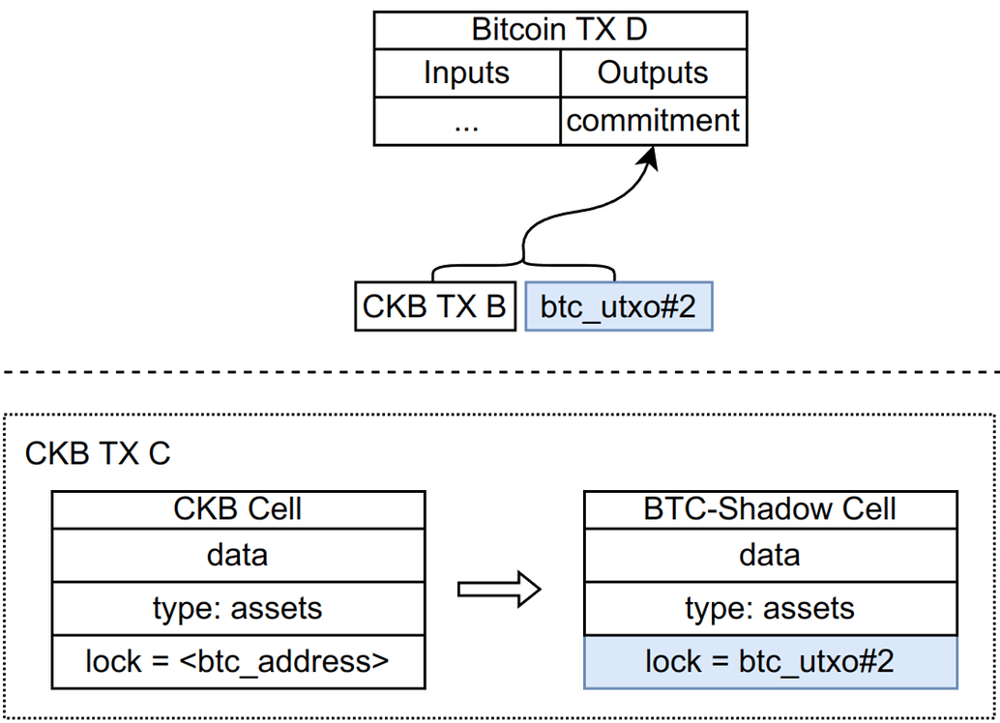
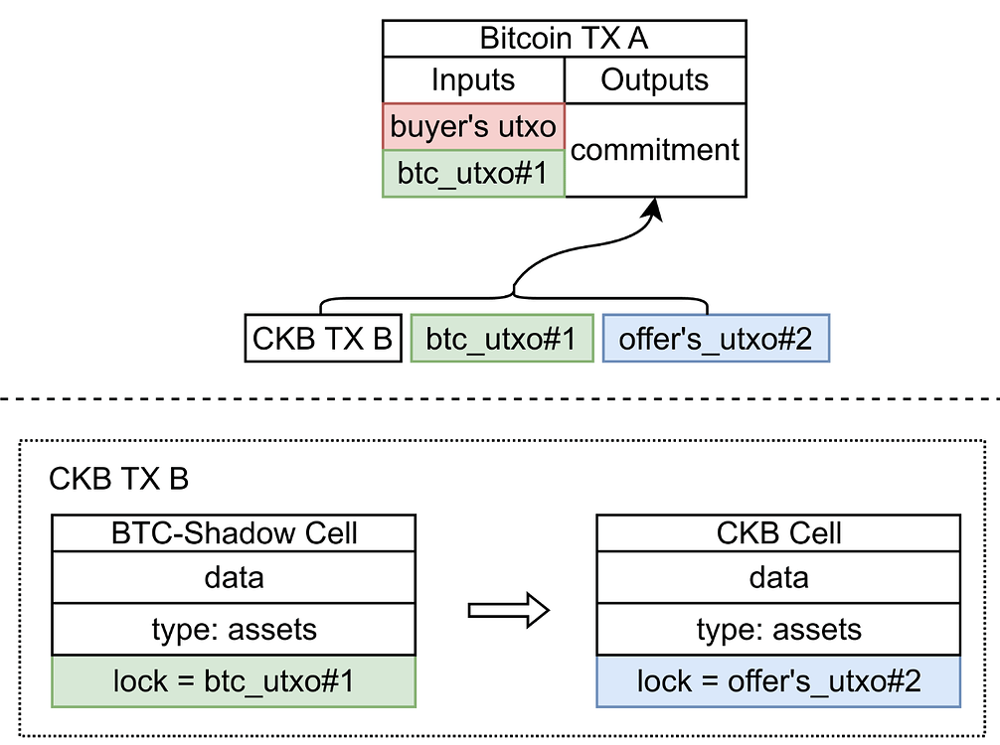

# RGB++ Protocol Light Paper

*Cipher from CELL Studio & Nervos Foundation*

> Special thanks to [Ajian](https://twitter.com/AurtrianAjian), [cyberorange](https://twitter.com/xcshuan), [Jan](https://twitter.com/busyforking), [Shawn](https://twitter.com/ShawnMelUni), and [DaPangDun](https://twitter.com/DaPangDunCrypto) for feedback and discussion.

# 简介

RGB++ 是一个基于 RGB 的扩展协议，利用一次性密封条和客户端验证技术来管理状态变更和交易验证。它通过同构绑定将比特币 UTXO 映射到 Nervos CKB 的 Cell 上，并利用 CKB 链和 Bitcoin 链上的脚本约束来验证状态计算的正确性和变更所有权的有效性。RGB++ 解决了原 RGB 协议在实际落地中的技术问题，并提供了更多的可能性，如区块链增强的客户端验证、交易折叠、共享状态与无主合约、非交互式转账等。它比特币带来了无须跨链、不损失安全性的图灵完备合约扩展和性能扩展。

### 一次性密封

一次性密密封的概念最早由 [Peter Todd 在 2016 年](https://petertodd.org/2016/state-machine-consensus-building-blocks)提出，它允许你对一条消息锁上一个电子密封条，确保这条消息只能被使用一次。具体来说，我们可以使用比特币的未花费的交易输出（UTXO）作为消息的密封条，比特币系统的共识机制可以确保这些 UTXO 仅能被消费一次，也即这些密封条仅能被打开一次。

RGB 协议利用这种基于比特币 UTXO 的一次性密封条，将 RGB 状态变更与比特币 UTXO 的所有权对应。因此比特币系统确保了 RGB 的状态所有权，以及可以通过 UTXO 历史来追溯所有的状态变更。一次性密封为 RGB 协议提供了由 Bitcoin 共识保障的防双花安全和交易分支追溯功能。

### 客户端验证

RGB 协议包含的用户状态无法由比特币共识直接验证，用户必须通过链外计算确保 RGB 的状态变更符合预期。客户端验证技术允许用户只需要验证与自己有关的 UTXO 分支历史，而无需关心与自己无关的交易历史。RGB 的状态安全性通过客户端验证方式保障，不依赖任何中心化第三方。

### RGB 协议的问题

尽管 RGB 协议有非常多的优势，尤其它可以为 Bitcoin 提供几乎不妥协的合约扩展，但在实际应用中依然存在多个技术和产品问题。

**DA 问题**

普通用户如何生成或获取交易历史的证明。普通用户使用简单的客户端产品时，并没有能力或资源保存所有的历史交易，也因此难以向交易对手方提供交易证明。

**P2P 网络问题**

RGB 交易作为 Bitcoin 的扩展交易，需要依赖一个 P2P 网络进行传播。用户之间在进行转账交易时，也需要进行交互式操作，接收方需要提供收条。这些都依赖一个独立于 Bitcoin 网络的 P2P 网络。

**虚拟机与合约语言**

RGB 协议的虚拟机目前主要是采用了 AluVM，作为新的虚拟机，目前缺乏完善的开发工具和实践代码。

**无主合约问题**

RGB 协议目前尚无完善的无主合约（公共合约）的交互方案。这导致多方交互难以实现。

### RGB++ 同构绑定

RGB++ 通过同构绑定技术解决了 RGB 协议遇到的问题，并赋予了 RGB 更多的可能性。在 RGB 协议中，最重要的两个组件是用来做所有权认定的 UTXO 和用来做状态管理与一次性密封的 commitment。RGB++ 的同构绑定将其中的 Bitcoin UTXO 一一映射到 CKB 的 Cell 上、使用 bitcoin utxo lock 来实现所有权同步，并使用 cell 的 data 和 type 来实现状态的维护。

### 区块链增强客户端验证

所有的 RGB++ 交易都会在 BTC 和 CKB 链上同步各出现一笔交易。前者与 RGB 协议的交易兼容，后者则取代了客户端验证的流程，用户只需要检查 CKB 上的相关交易即可验证这笔 RGB++ 交易的状态计算是否正确。但用户也可以不使用 CKB 链上的交易作为验证依据，利用 UTXO 的局部历史交易信息，用户可以脱离 CKB 链独立地对 RGB++ 交易进行验证（交易折叠等部分功能仍然需要依赖 CKB 的块头哈希做防双花验证）。

# RGB++ 交易流程

### 链外计算

- 选中下一次要使用的一次性密封条，例如 btc_utxo#2
- 链外计算并生成一笔将要发送到 CKB 上的 RGB++ 交易: CKB_TX_B
- 链外计算 `commitment = hash(CKB_TX_B | btc_utxo#1 | btc_utxo#2)`

### BTC 交易提交

- 生成并发送一笔比特币交易 Bitcoin_TX_A, 输入消耗 `btc_utxo#1`，输出通过 OP_RETURN 加入上面的 commitment

### CKB 交易提交

- 发送上述 CKB 交易 CKB_TX_B
- 用户的最新状态由 `CKB_TX_B.output.data` 维护
- 下一次变更状态需要使用 `btc_utxo#2`、`CKB_TX_B.output`

### 链上验证

- Bitcoin 验证相关的 utxo 只能被指定用户花费一次
- CKB 上存在 Bitcoin 的轻客户端，它可以验证 Bitcoin 上的相关交易存在 Bitcoin 链上
    - Bitcoin 的相关交易作为 ckb 交易的 witness 被提交上来，协助验证
- CKB 进一步验证该 btc 交易花费了正确的 utxo
- CKB 进一步验证该 btc 交易承诺了正确的 commitment
- CKB 验证 CKB 上的状态转移符合预订的合约规则

## RGB++ 客户端

不同于 RGB 协议，RGB++ 的所有交易都在 CKB 上并由 CKB 脚本约束验证，因此 RGB++ 无须独立客户端，用户只需要访问 Bitcoin 和 CKB 轻客户端即可验证所有交易。其中 CKB 轻客户端同样使用 PoW 算法可以实现最近的若干个块头即可验证所有历史交易和状态，进而利用同构绑定验证 RGB++ 的所有交易。

# 交易折叠

RGB++ 协议将 Bitcoin UTXO 与 CKB Cell 进行同构绑定，实现了 CKB Cell 验证支持的图灵完备 Bitcoin UTXO 交易。如果我们进一步利用 CKB Cell 的可编程能力，那么我们可以将多笔 CKB 交易与一笔 Bitcoin RGB++ 交易对应，这样就可以将低速低吞吐量的 Bitcoin 链使用高性能的 CKB 链进行扩容。

# 共享状态与无主合约

## 共享状态的平庸实现

共享状态一直是 UTXO 系统的难题，这里先讨论一种不考虑多人同时更新共享状态的平庸实现，再进一步讨论实际会采用的允许多人同时操作共享状态的解决方案。

考虑 CKB 上存在一个全局状态的 Cell，用来管理多用户共享的状态。典型地，它可以是一个算法稳定币的质押合约，用户将波动资产存入，并获得一个存款证明。全局状态由无主合约管理，所谓无主合约指的是任何人在满足合约的约束前提下都可以对状态进行变更，而不要求指定的数字签名提供方进行变更。无主合约的实现对协议的去中心化和抗审查有决定性的作用。

这里的平庸实现指的是 Global-state cell 有被其他用户占用的风险，这样 CKB TX 就会因为指定的 Global state utxo 不存在而无法成立。而 Bitcoin TX 需要先于 CKB TX 发送出来、并将其计算到 commitment 中，因此也无法进行后续的验证。

## 共享状态的状态争抢问题与解决方案

为了解决上述问题，我们引入了 Intent Cell 作为中介。用户将自己希望执行的动作确定性地写入 Intent Cell，后者则可以通过第三方聚合器的协作与全局状态 Cell 交互，批量将多方的 intent 进行计算，并将交互结果合并到标准的 shadow cell 上。

# 非交互式转账

原始 RGB 协议的一个问题是收款方需要提供一个自己的 live utxo 作为 invoice 才能实施转账，这种方式要求收款方必须在线才能完成一笔普通的交易，增加了用户理解难度和产品复杂度。RGB++ 可以利用图灵完备环境的优势，将交互行为放置在 ckb 环境里面，采用发送-领取两步操作来实现非交互式转账逻辑。

## 发送

用户 A 向用户 B 发送资产时，只需要获知 B 的地址，并在 RGB++ 交易中向该地址转账，而不需要收款人提供 utxo 或 invoice。

## 领取

CKB 的 lock 合约有能力验证 btc 地址对应的数字签名，因此接收方可以在 CKB 上构造 Tx C 来解锁对应的 CKB Cell，并将资产转移到自己的 utxo#2 上。从而完成了非交互式收款。

# Coins

RGB++ 上的 fungible 资产发行需要对应的数据结构标准和一致性验证标准。我们可以使用 ckb 的 xudt 标准作为它的同构绑定协议。

## 发行

RGB++ coins 的发行有很多种方式，包括并不限于中心化分发、空投、认购等方式。代币的总量也可以选择不设上限和预设上限两种。对于预设上限的代币，可以使用状态共享方案在每次发行时验证已发行总量小于等于预设上限。

## 转移

RGB++ coins 的转移非常简单，只需要将收款方和找零 utxo 分别对应到 ckb 的 shadow cell 即可。coins 的转移也可以通过交易折叠的方式只发生在 CKB 上，多笔交易后再将最后结果 commit 到 BTC 上。

## 隐私

xudt 是一个透明的代币协议，我们也可以采用支持金额隐私和流向隐私的代币协议来强化 RGB++ coins 的隐私保护特性。例如，我们可以使用 bulletproof 算法，将 data 中的内容变成盲化金额，并在每次转让的交易中提供金额一致且非负的零知识证明。这样，只有交易当事人知道当前交易的具体金额信息，第三方观察者无法获知金额数据。

此外，我们还可以使用环签名实现转账流向的盲化。用户的 coin 在 CKB 上转账给环签名混淆器，然后再回流到由 bitcoin utxo 管理的地址上。通过这种方式切断资金流的历史轨迹，从而完成地址的隐私保护。

# NFTs

## 发行

RGB++ 的 NFT 资产发行也可以利用到 ckb 上现有的 NFT 协议，包括不限于 Spore、mNFT 和 CoTA 协议。以 Spore 为例，它将所有的元数据均保留的链上，实现了数据可用性的 100% 安全。而 CoTA 协议则是利用状态压缩技术，将 NFT 信息和持有数据压缩在 32 字节的的 SMT 中，提供了极致的成本优势。

## 转移

RGB++ 中 NFT 的转让也非常简单，类似无须找零的 coins 转账。

# 闪电网络联通

RGB 作为客户端验证协议天然支持状态通道和闪电网络，但受限于 Bitcoin 的脚本计算能力，在 Bitcoin 上实现非 btc 的闪电网络非常困难。通过 RGB++ 协议的包裹，我们可以基于 CKB 的图灵完备脚本系统实现 RGB++ 资产的状态通道以及闪电网络。这项技术有着巨大的商业前景，例如基于闪电网络的稳定币支付系统可以提供低于中心化系统的成本和性能优势，同时保障了去中心化和抗审查特性。

# 应用举例

## Airdrop

给定一个地址列表和金额列表，我们可以使用 RGB++ 实现完整的 airdrop 应用。我们假设待领空投数据和已领地址列表均以 SMT 的信息保存在 cell data 中。用户即可通过自己的地址领取空投。

## DEX & AMM

RGB++ 利用 UTXO 结构可以直接支持基于 UTXO 的资产交换协议，无须引入中介方。同时利用网格订单簿设计可以实现自动化做市商模式，有别于 Uniswap 的价格曲线做市商模式，**网格做市商模式**可定制化更强，更适合 UTXO 结构的资产交易。

上面的例子是卖家挂单 RGB++ xudt，买家使用 Bitcoin 购买。交易结构为买家提供包含了足够数量 Bitcoin 的 buyer’s utxo 并提供 PBST 签名，买家则构造 CKB 上的交易来符合卖家的要求，最终买家将构造好的 CKB 交易发送给卖家，卖家将 BTC 交易和 CKB 交易先后上链完成交易。

# 总结

RGB++ 继承了 RGB 协议的核心思想，采用了不同的虚拟机和验证方案，用户无须独立的 RGB++ 客户端，只需要访问 Bitcoin 和 CKB 轻节点即可独立完成所有的验证。RGB++ 为 Bitcoin 带来了图灵完备合约扩展和数十倍的性能扩展。它没有使用任何跨链桥，而是使用了原生的客户端验证方案，确保了安全性和抗审查性。